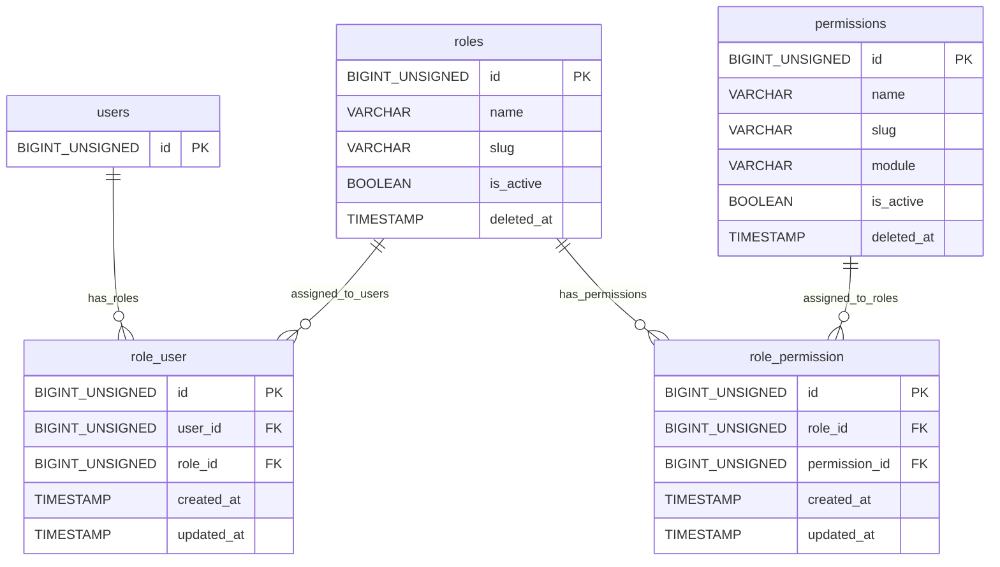
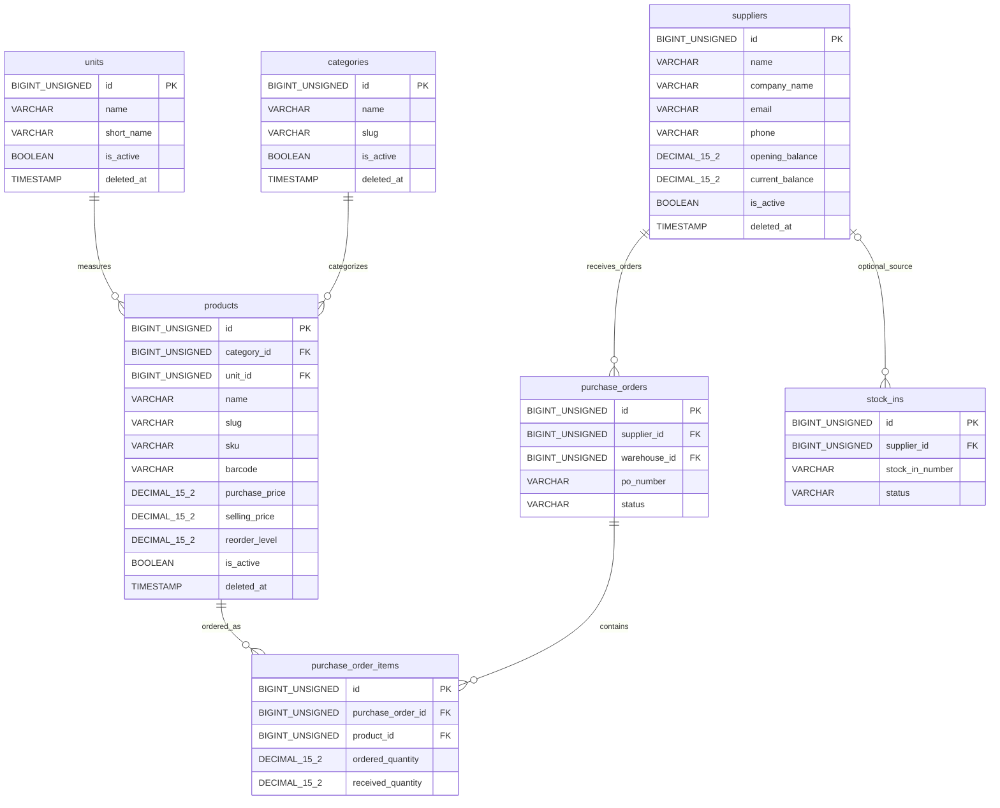
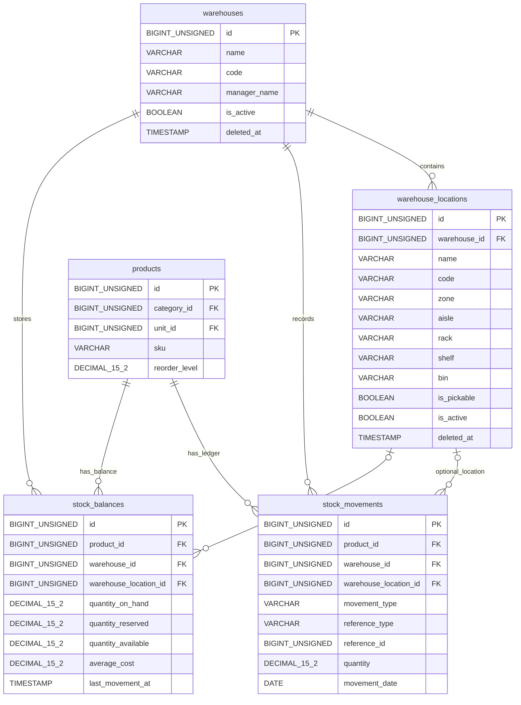
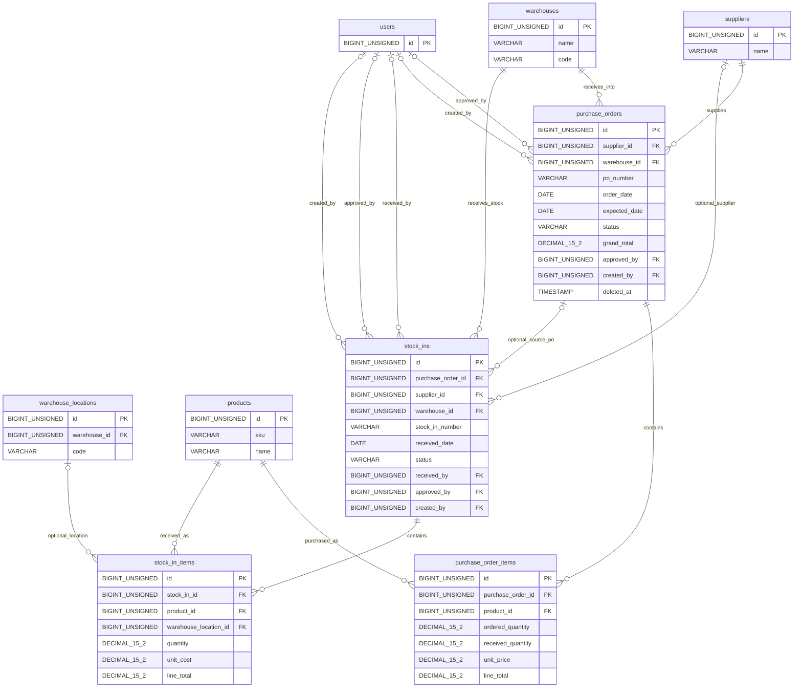
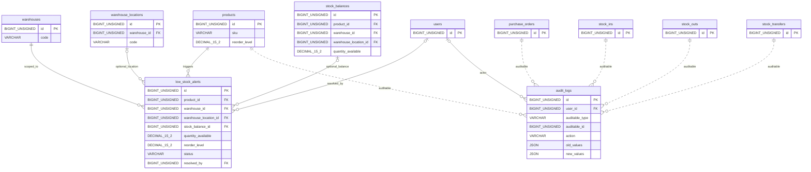

# Warehouse Management – Laravel ERD

## Purpose

This document defines the portfolio-ready Entity Relationship Diagram (ERD) documentation for **Warehouse Management – Laravel**.

The ERD is based on the current source-of-truth database design file: [`docs/database/database-design.md`](database-design.md).

Current database design commit:

```text
7528272 docs: add database design documentation
```

The goal of this document is to make the database structure easy to review, explain, and implement in Laravel 12 while preserving the relationships and constraints described in the database design document.

## ERD Notation Legend

| Concept | Mermaid notation | Meaning |
| --- | --- | --- |
| One-to-one | `||--||` | One parent row relates to exactly one child row. No one-to-one relationship is currently defined in the source design. |
| One-to-many | `||--o{` | One parent row can relate to zero or many child rows. |
| Many-to-many | `}o--o{` | Many rows on both sides are connected, implemented through a pivot table in this design. |
| Optional relationship | `|o` | The child foreign key is nullable, so the child may exist without a parent reference. |
| Required relationship | `||` | The child foreign key is required, so each child row must reference a parent row. |
| Primary key | `PK` | Primary key column, normally `id`. |
| Foreign key | `FK` | Column that references another table primary key. |
| Logical reference | `..` | Non-FK reference stored through type/id columns, such as `reference_type` and `reference_id`. |

## Table Grouping

| Group | Tables |
| --- | --- |
| Authentication & Authorization | `users`, `roles`, `permissions`, `role_user`, `role_permission` |
| Product Catalog | `categories`, `units`, `products` |
| Supplier Management | `suppliers` |
| Warehouse Management | `warehouses`, `warehouse_locations` |
| Inventory / Stock Ledger | `stock_movements`, `stock_balances` |
| Purchase Order Workflow | `purchase_orders`, `purchase_order_items` |
| Stock In | `stock_ins`, `stock_in_items` |
| Stock Out | `stock_outs`, `stock_out_items` |
| Stock Transfer | `stock_transfers`, `stock_transfer_items` |
| Alerts | `low_stock_alerts` |
| Audit Logs | `audit_logs` |

## High-Level ERD Overview

The system separates reusable master data from transactional stock operations. Products are classified by `categories` and measured by `units`; they do not store stock quantity directly. Warehouses are modeled separately from internal `warehouse_locations`, allowing the same product to exist across multiple warehouses and locations.

Suppliers feed the purchase order workflow through `purchase_orders` and `purchase_order_items`. Approved and physically received goods are represented by `stock_ins` and `stock_in_items`; only posted stock operations should create inventory history in `stock_movements` and update current quantity in `stock_balances`.

Stock leaving the business is tracked through `stock_outs` and `stock_out_items`. Internal movement between warehouses or locations is tracked through `stock_transfers` and `stock_transfer_items`. Transfers create both outbound and inbound stock movement records after posting.

Authorization is handled through custom roles and permissions using `role_user` and `role_permission` pivot tables. Low stock alerts are stored as history in `low_stock_alerts`, and business/system activity is preserved in `audit_logs`.

## Assumption / Needs Review Notes

- The source design defines delete strategy at a category level, not as an exact migration method for every foreign key. The foreign key summary marks non-pivot delete behavior as **Assumption / Needs Review**.
- The `users` table is listed as a Laravel default table and is referenced by many custom tables, but its full column list is not defined in the design document. ERD diagrams include only `users.id`.
- `stock_movements.reference_type` and `stock_movements.reference_id` are logical source-document references, not database-level foreign keys.
- `audit_logs.auditable_type` and `audit_logs.auditable_id` are logical auditable-record references, not database-level foreign keys.
- `stock_balances` has a conceptual unique rule on `product_id`, `warehouse_id`, and `warehouse_location_id`. Because `warehouse_location_id` is nullable, the design requires controlled service-layer enforcement or a later database-level strategy review.

## Mermaid ER Diagrams

### Authentication & Authorization ERD



### Product / Category / Supplier ERD



Supplier-to-product relationships are not stored directly. They are traceable through purchase order items and stock-in documents.

### Warehouse & Inventory ERD



### Purchase Order Workflow ERD



### Stock Movement ERD

```mermaid
erDiagram
    users {
        BIGINT_UNSIGNED id PK
    }

    products {
        BIGINT_UNSIGNED id PK
        VARCHAR sku
        VARCHAR name
    }

    warehouses {
        BIGINT_UNSIGNED id PK
        VARCHAR code
        VARCHAR name
    }

    warehouse_locations {
        BIGINT_UNSIGNED id PK
        BIGINT_UNSIGNED warehouse_id FK
        VARCHAR code
    }

    stock_ins {
        BIGINT_UNSIGNED id PK
        VARCHAR stock_in_number
    }

    stock_in_items {
        BIGINT_UNSIGNED id PK
        BIGINT_UNSIGNED stock_in_id FK
        BIGINT_UNSIGNED product_id FK
        BIGINT_UNSIGNED warehouse_location_id FK
        DECIMAL_15_2 quantity
    }

    stock_outs {
        BIGINT_UNSIGNED id PK
        BIGINT_UNSIGNED warehouse_id FK
        VARCHAR stock_out_number
        VARCHAR reason_type
        VARCHAR status
    }

    stock_out_items {
        BIGINT_UNSIGNED id PK
        BIGINT_UNSIGNED stock_out_id FK
        BIGINT_UNSIGNED product_id FK
        BIGINT_UNSIGNED warehouse_location_id FK
        DECIMAL_15_2 quantity
    }

    stock_transfers {
        BIGINT_UNSIGNED id PK
        BIGINT_UNSIGNED from_warehouse_id FK
        BIGINT_UNSIGNED to_warehouse_id FK
        VARCHAR transfer_number
        VARCHAR status
    }

    stock_transfer_items {
        BIGINT_UNSIGNED id PK
        BIGINT_UNSIGNED stock_transfer_id FK
        BIGINT_UNSIGNED product_id FK
        BIGINT_UNSIGNED from_warehouse_location_id FK
        BIGINT_UNSIGNED to_warehouse_location_id FK
        DECIMAL_15_2 quantity
    }

    stock_movements {
        BIGINT_UNSIGNED id PK
        BIGINT_UNSIGNED product_id FK
        BIGINT_UNSIGNED warehouse_id FK
        BIGINT_UNSIGNED warehouse_location_id FK
        VARCHAR movement_type
        VARCHAR reference_type
        BIGINT_UNSIGNED reference_id
        DECIMAL_15_2 quantity
        BIGINT_UNSIGNED created_by FK
    }

    stock_balances {
        BIGINT_UNSIGNED id PK
        BIGINT_UNSIGNED product_id FK
        BIGINT_UNSIGNED warehouse_id FK
        BIGINT_UNSIGNED warehouse_location_id FK
        DECIMAL_15_2 quantity_on_hand
        DECIMAL_15_2 quantity_available
    }

    warehouses ||--o{ stock_outs : issues_from
    stock_ins ||--o{ stock_in_items : contains
    stock_outs ||--o{ stock_out_items : contains
    stock_transfers ||--o{ stock_transfer_items : contains
    products ||--o{ stock_in_items : received_as
    products ||--o{ stock_out_items : issued_as
    products ||--o{ stock_transfer_items : transferred_as
    warehouse_locations |o--o{ stock_in_items : optional_location
    warehouse_locations |o--o{ stock_out_items : optional_location
    warehouse_locations |o--o{ stock_transfer_items : from_location
    warehouse_locations |o--o{ stock_transfer_items : to_location
    products ||--o{ stock_movements : ledger_entries
    warehouses ||--o{ stock_movements : stock_history
    warehouse_locations |o--o{ stock_movements : optional_location
    users |o--o{ stock_movements : created_by
    products ||--o{ stock_balances : current_balance
    warehouses ||--o{ stock_balances : current_balance
    warehouse_locations |o--o{ stock_balances : optional_location
    stock_ins ||..o{ stock_movements : logical_reference
    stock_outs ||..o{ stock_movements : logical_reference
    stock_transfers ||..o{ stock_movements : logical_reference
```



The dotted relationships to `stock_movements` are logical references through `reference_type` and `reference_id`, not physical foreign keys.

### Audit & Alert ERD



The dotted relationships to `audit_logs` are logical references through `auditable_type` and `auditable_id`, not physical foreign keys.

### Full System ERD

```mermaid
erDiagram
    users {
        BIGINT_UNSIGNED id PK
    }

    roles {
        BIGINT_UNSIGNED id PK
        VARCHAR slug
    }

    permissions {
        BIGINT_UNSIGNED id PK
        VARCHAR slug
        VARCHAR module
    }

    role_user {
        BIGINT_UNSIGNED id PK
        BIGINT_UNSIGNED user_id FK
        BIGINT_UNSIGNED role_id FK
    }

    role_permission {
        BIGINT_UNSIGNED id PK
        BIGINT_UNSIGNED role_id FK
        BIGINT_UNSIGNED permission_id FK
    }

    categories {
        BIGINT_UNSIGNED id PK
        VARCHAR slug
    }

    units {
        BIGINT_UNSIGNED id PK
        VARCHAR short_name
    }

    suppliers {
        BIGINT_UNSIGNED id PK
        VARCHAR name
    }

    warehouses {
        BIGINT_UNSIGNED id PK
        VARCHAR code
    }

    warehouse_locations {
        BIGINT_UNSIGNED id PK
        BIGINT_UNSIGNED warehouse_id FK
        VARCHAR code
    }

    products {
        BIGINT_UNSIGNED id PK
        BIGINT_UNSIGNED category_id FK
        BIGINT_UNSIGNED unit_id FK
        VARCHAR sku
        DECIMAL_15_2 reorder_level
    }

    purchase_orders {
        BIGINT_UNSIGNED id PK
        BIGINT_UNSIGNED supplier_id FK
        BIGINT_UNSIGNED warehouse_id FK
        BIGINT_UNSIGNED approved_by FK
        BIGINT_UNSIGNED created_by FK
        VARCHAR po_number
        VARCHAR status
    }

    purchase_order_items {
        BIGINT_UNSIGNED id PK
        BIGINT_UNSIGNED purchase_order_id FK
        BIGINT_UNSIGNED product_id FK
    }

    stock_ins {
        BIGINT_UNSIGNED id PK
        BIGINT_UNSIGNED purchase_order_id FK
        BIGINT_UNSIGNED supplier_id FK
        BIGINT_UNSIGNED warehouse_id FK
        BIGINT_UNSIGNED received_by FK
        BIGINT_UNSIGNED approved_by FK
        BIGINT_UNSIGNED created_by FK
    }

    stock_in_items {
        BIGINT_UNSIGNED id PK
        BIGINT_UNSIGNED stock_in_id FK
        BIGINT_UNSIGNED product_id FK
        BIGINT_UNSIGNED warehouse_location_id FK
    }

    stock_outs {
        BIGINT_UNSIGNED id PK
        BIGINT_UNSIGNED warehouse_id FK
        BIGINT_UNSIGNED issued_by FK
        BIGINT_UNSIGNED approved_by FK
        BIGINT_UNSIGNED created_by FK
    }

    stock_out_items {
        BIGINT_UNSIGNED id PK
        BIGINT_UNSIGNED stock_out_id FK
        BIGINT_UNSIGNED product_id FK
        BIGINT_UNSIGNED warehouse_location_id FK
    }

    stock_transfers {
        BIGINT_UNSIGNED id PK
        BIGINT_UNSIGNED from_warehouse_id FK
        BIGINT_UNSIGNED to_warehouse_id FK
        BIGINT_UNSIGNED requested_by FK
        BIGINT_UNSIGNED approved_by FK
        BIGINT_UNSIGNED dispatched_by FK
        BIGINT_UNSIGNED received_by FK
        BIGINT_UNSIGNED created_by FK
    }

    stock_transfer_items {
        BIGINT_UNSIGNED id PK
        BIGINT_UNSIGNED stock_transfer_id FK
        BIGINT_UNSIGNED product_id FK
        BIGINT_UNSIGNED from_warehouse_location_id FK
        BIGINT_UNSIGNED to_warehouse_location_id FK
    }

    stock_movements {
        BIGINT_UNSIGNED id PK
        BIGINT_UNSIGNED product_id FK
        BIGINT_UNSIGNED warehouse_id FK
        BIGINT_UNSIGNED warehouse_location_id FK
        VARCHAR reference_type
        BIGINT_UNSIGNED reference_id
        DECIMAL_15_2 quantity
        BIGINT_UNSIGNED created_by FK
    }

    stock_balances {
        BIGINT_UNSIGNED id PK
        BIGINT_UNSIGNED product_id FK
        BIGINT_UNSIGNED warehouse_id FK
        BIGINT_UNSIGNED warehouse_location_id FK
        DECIMAL_15_2 quantity_available
    }

    low_stock_alerts {
        BIGINT_UNSIGNED id PK
        BIGINT_UNSIGNED product_id FK
        BIGINT_UNSIGNED warehouse_id FK
        BIGINT_UNSIGNED warehouse_location_id FK
        BIGINT_UNSIGNED stock_balance_id FK
        BIGINT_UNSIGNED resolved_by FK
    }

    audit_logs {
        BIGINT_UNSIGNED id PK
        BIGINT_UNSIGNED user_id FK
        VARCHAR auditable_type
        BIGINT_UNSIGNED auditable_id
    }

    users ||--o{ role_user : user_id
    roles ||--o{ role_user : role_id
    roles ||--o{ role_permission : role_id
    permissions ||--o{ role_permission : permission_id
    categories ||--o{ products : category_id
    units ||--o{ products : unit_id
    warehouses ||--o{ warehouse_locations : warehouse_id
    suppliers ||--o{ purchase_orders : supplier_id
    warehouses ||--o{ purchase_orders : warehouse_id
    users |o--o{ purchase_orders : approved_by
    users |o--o{ purchase_orders : created_by
    purchase_orders ||--o{ purchase_order_items : purchase_order_id
    products ||--o{ purchase_order_items : product_id
    purchase_orders |o--o{ stock_ins : purchase_order_id
    suppliers |o--o{ stock_ins : supplier_id
    warehouses ||--o{ stock_ins : warehouse_id
    users |o--o{ stock_ins : received_by
    users |o--o{ stock_ins : approved_by
    users |o--o{ stock_ins : created_by
    stock_ins ||--o{ stock_in_items : stock_in_id
    products ||--o{ stock_in_items : product_id
    warehouse_locations |o--o{ stock_in_items : warehouse_location_id
    warehouses ||--o{ stock_outs : warehouse_id
    users |o--o{ stock_outs : issued_by
    users |o--o{ stock_outs : approved_by
    users |o--o{ stock_outs : created_by
    stock_outs ||--o{ stock_out_items : stock_out_id
    products ||--o{ stock_out_items : product_id
    warehouse_locations |o--o{ stock_out_items : warehouse_location_id
    warehouses ||--o{ stock_transfers : from_warehouse_id
    warehouses ||--o{ stock_transfers : to_warehouse_id
    users |o--o{ stock_transfers : requested_by
    users |o--o{ stock_transfers : approved_by
    users |o--o{ stock_transfers : dispatched_by
    users |o--o{ stock_transfers : received_by
    users |o--o{ stock_transfers : created_by
    stock_transfers ||--o{ stock_transfer_items : stock_transfer_id
    products ||--o{ stock_transfer_items : product_id
    warehouse_locations |o--o{ stock_transfer_items : from_warehouse_location_id
    warehouse_locations |o--o{ stock_transfer_items : to_warehouse_location_id
    products ||--o{ stock_movements : product_id
    warehouses ||--o{ stock_movements : warehouse_id
    warehouse_locations |o--o{ stock_movements : warehouse_location_id
    users |o--o{ stock_movements : created_by
    products ||--o{ stock_balances : product_id
    warehouses ||--o{ stock_balances : warehouse_id
    warehouse_locations |o--o{ stock_balances : warehouse_location_id
    products ||--o{ low_stock_alerts : product_id
    warehouses ||--o{ low_stock_alerts : warehouse_id
    warehouse_locations |o--o{ low_stock_alerts : warehouse_location_id
    stock_balances |o--o{ low_stock_alerts : stock_balance_id
    users |o--o{ low_stock_alerts : resolved_by
    users |o--o{ audit_logs : user_id
```



## Relationship Documentation

| Parent table | Child table | Foreign key | Cardinality | Business meaning |
| --- | --- | --- | --- | --- |
| `users` | `role_user` | `user_id` | One user to many pivot rows | Assigns one or more roles to a user through the `role_user` pivot table. |
| `roles` | `role_user` | `role_id` | One role to many pivot rows | Allows one role to be assigned to many users. |
| `roles` | `role_permission` | `role_id` | One role to many pivot rows | Allows one role to receive many permissions. |
| `permissions` | `role_permission` | `permission_id` | One permission to many pivot rows | Allows one permission to be assigned to many roles. |
| `categories` | `products` | `category_id` | One-to-many, required | Groups products by category. |
| `units` | `products` | `unit_id` | One-to-many, required | Defines the measurement unit used by a product. |
| `warehouses` | `warehouse_locations` | `warehouse_id` | One-to-many, required | Breaks a warehouse into zones, aisles, racks, shelves, or bins. |
| `suppliers` | `purchase_orders` | `supplier_id` | One-to-many, required | Identifies the supplier for a purchase order. |
| `warehouses` | `purchase_orders` | `warehouse_id` | One-to-many, required | Identifies the receiving warehouse for a purchase order. |
| `users` | `purchase_orders` | `approved_by` | One-to-many, optional | Records the user who approved a purchase order. |
| `users` | `purchase_orders` | `created_by` | One-to-many, optional | Records the user who created a purchase order. |
| `purchase_orders` | `purchase_order_items` | `purchase_order_id` | One-to-many, required | Stores product lines under a purchase order header. |
| `products` | `purchase_order_items` | `product_id` | One-to-many, required | Identifies the product being ordered. |
| `purchase_orders` | `stock_ins` | `purchase_order_id` | One-to-many, optional | Links receiving records to an approved purchase order when applicable. |
| `suppliers` | `stock_ins` | `supplier_id` | One-to-many, optional | Links a stock-in record to a supplier when applicable. |
| `warehouses` | `stock_ins` | `warehouse_id` | One-to-many, required | Identifies the warehouse receiving stock. |
| `users` | `stock_ins` | `received_by` | One-to-many, optional | Records the user who received the goods. |
| `users` | `stock_ins` | `approved_by` | One-to-many, optional | Records the user who approved the stock-in. |
| `users` | `stock_ins` | `created_by` | One-to-many, optional | Records the user who created the stock-in. |
| `stock_ins` | `stock_in_items` | `stock_in_id` | One-to-many, required | Stores received product lines under a stock-in header. |
| `products` | `stock_in_items` | `product_id` | One-to-many, required | Identifies the received product. |
| `warehouse_locations` | `stock_in_items` | `warehouse_location_id` | One-to-many, optional | Identifies the receiving location inside a warehouse when tracked. |
| `warehouses` | `stock_outs` | `warehouse_id` | One-to-many, required | Identifies the warehouse issuing stock. |
| `users` | `stock_outs` | `issued_by` | One-to-many, optional | Records the user who issued the goods. |
| `users` | `stock_outs` | `approved_by` | One-to-many, optional | Records the user who approved the stock-out. |
| `users` | `stock_outs` | `created_by` | One-to-many, optional | Records the user who created the stock-out. |
| `stock_outs` | `stock_out_items` | `stock_out_id` | One-to-many, required | Stores issued product lines under a stock-out header. |
| `products` | `stock_out_items` | `product_id` | One-to-many, required | Identifies the issued product. |
| `warehouse_locations` | `stock_out_items` | `warehouse_location_id` | One-to-many, optional | Identifies the issuing location inside a warehouse when tracked. |
| `warehouses` | `stock_transfers` | `from_warehouse_id` | One-to-many, required | Identifies the source warehouse for a transfer. |
| `warehouses` | `stock_transfers` | `to_warehouse_id` | One-to-many, required | Identifies the destination warehouse for a transfer. |
| `users` | `stock_transfers` | `requested_by` | One-to-many, optional | Records the user who requested a transfer. |
| `users` | `stock_transfers` | `approved_by` | One-to-many, optional | Records the user who approved a transfer. |
| `users` | `stock_transfers` | `dispatched_by` | One-to-many, optional | Records the user who dispatched transfer stock. |
| `users` | `stock_transfers` | `received_by` | One-to-many, optional | Records the user who received transfer stock. |
| `users` | `stock_transfers` | `created_by` | One-to-many, optional | Records the user who created a transfer. |
| `stock_transfers` | `stock_transfer_items` | `stock_transfer_id` | One-to-many, required | Stores product lines under a transfer header. |
| `products` | `stock_transfer_items` | `product_id` | One-to-many, required | Identifies the transferred product. |
| `warehouse_locations` | `stock_transfer_items` | `from_warehouse_location_id` | One-to-many, optional | Identifies the source location when tracked. |
| `warehouse_locations` | `stock_transfer_items` | `to_warehouse_location_id` | One-to-many, optional | Identifies the destination location when tracked. |
| `products` | `stock_movements` | `product_id` | One-to-many, required | Connects each inventory ledger entry to a product. |
| `warehouses` | `stock_movements` | `warehouse_id` | One-to-many, required | Connects each inventory ledger entry to a warehouse. |
| `warehouse_locations` | `stock_movements` | `warehouse_location_id` | One-to-many, optional | Connects each inventory ledger entry to a warehouse location when tracked. |
| `users` | `stock_movements` | `created_by` | One-to-many, optional | Records the user responsible for creating the ledger entry. |
| `products` | `stock_balances` | `product_id` | One-to-many, required | Stores current stock quantity per product. |
| `warehouses` | `stock_balances` | `warehouse_id` | One-to-many, required | Stores current stock quantity per warehouse. |
| `warehouse_locations` | `stock_balances` | `warehouse_location_id` | One-to-many, optional | Stores current stock quantity per location when tracked. |
| `products` | `low_stock_alerts` | `product_id` | One-to-many, required | Records low stock events for a product. |
| `warehouses` | `low_stock_alerts` | `warehouse_id` | One-to-many, required | Scopes low stock alerts to a warehouse. |
| `warehouse_locations` | `low_stock_alerts` | `warehouse_location_id` | One-to-many, optional | Scopes low stock alerts to a location when tracked. |
| `stock_balances` | `low_stock_alerts` | `stock_balance_id` | One-to-many, optional | Links an alert to the stock balance row that triggered it. |
| `users` | `low_stock_alerts` | `resolved_by` | One-to-many, optional | Records the user who resolved the alert. |
| `users` | `audit_logs` | `user_id` | One-to-many, optional | Records the user who performed an audited action. |

### Logical References

| Source | Target | Reference columns | Type | Business meaning |
| --- | --- | --- | --- | --- |
| `stock_ins` | `stock_movements` | `reference_type`, `reference_id` | Logical reference, not FK | A posted stock-in creates positive ledger movement records. |
| `stock_outs` | `stock_movements` | `reference_type`, `reference_id` | Logical reference, not FK | A posted stock-out creates negative ledger movement records. |
| `stock_transfers` | `stock_movements` | `reference_type`, `reference_id` | Logical reference, not FK | A posted transfer creates both outbound and inbound ledger movement records. |
| Business records | `audit_logs` | `auditable_type`, `auditable_id` | Logical reference, not FK | Audit logs can point to many auditable record types without adding many nullable FK columns. |

## Foreign Key Summary

| Table | Foreign Key | References | On Delete behavior | Relationship type |
| --- | --- | --- | --- | --- |
| `role_user` | `user_id` | `users.id` | `cascadeOnDelete()` documented for pivot tables | Many-to-many pivot |
| `role_user` | `role_id` | `roles.id` | `cascadeOnDelete()` documented for pivot tables | Many-to-many pivot |
| `role_permission` | `role_id` | `roles.id` | `cascadeOnDelete()` documented for pivot tables | Many-to-many pivot |
| `role_permission` | `permission_id` | `permissions.id` | `cascadeOnDelete()` documented for pivot tables | Many-to-many pivot |
| `warehouse_locations` | `warehouse_id` | `warehouses.id` | Assumption / Needs Review: `restrictOnDelete()` | Required one-to-many |
| `products` | `category_id` | `categories.id` | Assumption / Needs Review: `restrictOnDelete()` | Required one-to-many |
| `products` | `unit_id` | `units.id` | Assumption / Needs Review: `restrictOnDelete()` | Required one-to-many |
| `purchase_orders` | `supplier_id` | `suppliers.id` | Assumption / Needs Review: `restrictOnDelete()` | Required one-to-many |
| `purchase_orders` | `warehouse_id` | `warehouses.id` | Assumption / Needs Review: `restrictOnDelete()` | Required one-to-many |
| `purchase_orders` | `approved_by` | `users.id` | Assumption / Needs Review: `nullOnDelete()` | Optional one-to-many |
| `purchase_orders` | `created_by` | `users.id` | Assumption / Needs Review: `nullOnDelete()` | Optional one-to-many |
| `purchase_order_items` | `purchase_order_id` | `purchase_orders.id` | Assumption / Needs Review: `restrictOnDelete()` | Required one-to-many |
| `purchase_order_items` | `product_id` | `products.id` | Assumption / Needs Review: `restrictOnDelete()` | Required one-to-many |
| `stock_ins` | `purchase_order_id` | `purchase_orders.id` | Assumption / Needs Review: `nullOnDelete()` | Optional one-to-many |
| `stock_ins` | `supplier_id` | `suppliers.id` | Assumption / Needs Review: `nullOnDelete()` | Optional one-to-many |
| `stock_ins` | `warehouse_id` | `warehouses.id` | Assumption / Needs Review: `restrictOnDelete()` | Required one-to-many |
| `stock_ins` | `received_by` | `users.id` | Assumption / Needs Review: `nullOnDelete()` | Optional one-to-many |
| `stock_ins` | `approved_by` | `users.id` | Assumption / Needs Review: `nullOnDelete()` | Optional one-to-many |
| `stock_ins` | `created_by` | `users.id` | Assumption / Needs Review: `nullOnDelete()` | Optional one-to-many |
| `stock_in_items` | `stock_in_id` | `stock_ins.id` | Assumption / Needs Review: `restrictOnDelete()` | Required one-to-many |
| `stock_in_items` | `product_id` | `products.id` | Assumption / Needs Review: `restrictOnDelete()` | Required one-to-many |
| `stock_in_items` | `warehouse_location_id` | `warehouse_locations.id` | Assumption / Needs Review: `nullOnDelete()` | Optional one-to-many |
| `stock_outs` | `warehouse_id` | `warehouses.id` | Assumption / Needs Review: `restrictOnDelete()` | Required one-to-many |
| `stock_outs` | `issued_by` | `users.id` | Assumption / Needs Review: `nullOnDelete()` | Optional one-to-many |
| `stock_outs` | `approved_by` | `users.id` | Assumption / Needs Review: `nullOnDelete()` | Optional one-to-many |
| `stock_outs` | `created_by` | `users.id` | Assumption / Needs Review: `nullOnDelete()` | Optional one-to-many |
| `stock_out_items` | `stock_out_id` | `stock_outs.id` | Assumption / Needs Review: `restrictOnDelete()` | Required one-to-many |
| `stock_out_items` | `product_id` | `products.id` | Assumption / Needs Review: `restrictOnDelete()` | Required one-to-many |
| `stock_out_items` | `warehouse_location_id` | `warehouse_locations.id` | Assumption / Needs Review: `nullOnDelete()` | Optional one-to-many |
| `stock_transfers` | `from_warehouse_id` | `warehouses.id` | Assumption / Needs Review: `restrictOnDelete()` | Required one-to-many |
| `stock_transfers` | `to_warehouse_id` | `warehouses.id` | Assumption / Needs Review: `restrictOnDelete()` | Required one-to-many |
| `stock_transfers` | `requested_by` | `users.id` | Assumption / Needs Review: `nullOnDelete()` | Optional one-to-many |
| `stock_transfers` | `approved_by` | `users.id` | Assumption / Needs Review: `nullOnDelete()` | Optional one-to-many |
| `stock_transfers` | `dispatched_by` | `users.id` | Assumption / Needs Review: `nullOnDelete()` | Optional one-to-many |
| `stock_transfers` | `received_by` | `users.id` | Assumption / Needs Review: `nullOnDelete()` | Optional one-to-many |
| `stock_transfers` | `created_by` | `users.id` | Assumption / Needs Review: `nullOnDelete()` | Optional one-to-many |
| `stock_transfer_items` | `stock_transfer_id` | `stock_transfers.id` | Assumption / Needs Review: `restrictOnDelete()` | Required one-to-many |
| `stock_transfer_items` | `product_id` | `products.id` | Assumption / Needs Review: `restrictOnDelete()` | Required one-to-many |
| `stock_transfer_items` | `from_warehouse_location_id` | `warehouse_locations.id` | Assumption / Needs Review: `nullOnDelete()` | Optional one-to-many |
| `stock_transfer_items` | `to_warehouse_location_id` | `warehouse_locations.id` | Assumption / Needs Review: `nullOnDelete()` | Optional one-to-many |
| `stock_movements` | `product_id` | `products.id` | Assumption / Needs Review: `restrictOnDelete()` | Required one-to-many |
| `stock_movements` | `warehouse_id` | `warehouses.id` | Assumption / Needs Review: `restrictOnDelete()` | Required one-to-many |
| `stock_movements` | `warehouse_location_id` | `warehouse_locations.id` | Assumption / Needs Review: `nullOnDelete()` | Optional one-to-many |
| `stock_movements` | `created_by` | `users.id` | Assumption / Needs Review: `nullOnDelete()` | Optional one-to-many |
| `stock_balances` | `product_id` | `products.id` | Assumption / Needs Review: `restrictOnDelete()` | Required one-to-many |
| `stock_balances` | `warehouse_id` | `warehouses.id` | Assumption / Needs Review: `restrictOnDelete()` | Required one-to-many |
| `stock_balances` | `warehouse_location_id` | `warehouse_locations.id` | Assumption / Needs Review: `nullOnDelete()` | Optional one-to-many |
| `low_stock_alerts` | `product_id` | `products.id` | Assumption / Needs Review: `restrictOnDelete()` | Required one-to-many |
| `low_stock_alerts` | `warehouse_id` | `warehouses.id` | Assumption / Needs Review: `restrictOnDelete()` | Required one-to-many |
| `low_stock_alerts` | `warehouse_location_id` | `warehouse_locations.id` | Assumption / Needs Review: `nullOnDelete()` | Optional one-to-many |
| `low_stock_alerts` | `stock_balance_id` | `stock_balances.id` | Assumption / Needs Review: `nullOnDelete()` | Optional one-to-many |
| `low_stock_alerts` | `resolved_by` | `users.id` | Assumption / Needs Review: `nullOnDelete()` | Optional one-to-many |
| `audit_logs` | `user_id` | `users.id` | Assumption / Needs Review: `nullOnDelete()` | Optional one-to-many |

## Portfolio Explanation

This ERD is production-ready because the design keeps clear boundaries between master data, transactional documents, inventory ledger entries, current stock snapshots, alerts, and audit history.

- **Normalized structure:** Product metadata, warehouse structure, suppliers, purchase documents, stock operations, and authorization records are separated into focused tables with clear foreign keys.
- **Clear module boundaries:** Authentication, catalog, supplier management, warehouse management, purchase orders, stock in, stock out, transfers, inventory, alerts, and audit logs can be developed and tested independently.
- **Traceable stock movement:** Stock quantity is not stored in `products`; historical changes are recorded in `stock_movements`, while current availability is optimized through `stock_balances`.
- **Auditability:** Approval, creation, receiving, dispatching, resolving, and general audited actions are connected to `users` where the source design defines those references.
- **Scalable warehouse/product/inventory design:** The combination of `products`, `warehouses`, `warehouse_locations`, `stock_movements`, and `stock_balances` supports multi-warehouse and location-level inventory without changing product master data.

## Common Implementation Notes

- Use Laravel `belongsTo` on child models that contain a foreign key, such as `Product::category()`, `PurchaseOrder::supplier()`, and `StockMovement::product()`.
- Use Laravel `hasMany` on parent models, such as `Category::products()`, `Warehouse::warehouseLocations()`, `PurchaseOrder::items()`, and `Product::stockMovements()`.
- Use Laravel `belongsToMany` for user-role and role-permission access control through the `role_user` and `role_permission` pivot tables.
- Treat `role_user` and `role_permission` as pivot tables with composite uniqueness on their paired foreign keys.
- Use Laravel `foreignId()` or `foreignId()->nullable()` consistently with the nullable/required status documented in the database design.
- Index every foreign key column. The source design explicitly lists indexes for foreign keys and high-use query fields such as `status`, dates, `batch_number`, `expiry_date`, and `quantity_available`.
- Keep stock posting in a service layer wrapped in a database transaction: create `stock_movements`, update or create `stock_balances`, then create `audit_logs`.
- Do not update `stock_balances` directly from controllers. The design requires every stock balance update to be traceable to a matching stock movement.
- Store status values as `VARCHAR(30)` and control allowed transitions through Laravel model constants, validation rules, and service-layer workflow checks.
- Use `DECIMAL(15,2)` for inventory quantities and money values to avoid floating-point precision issues.
