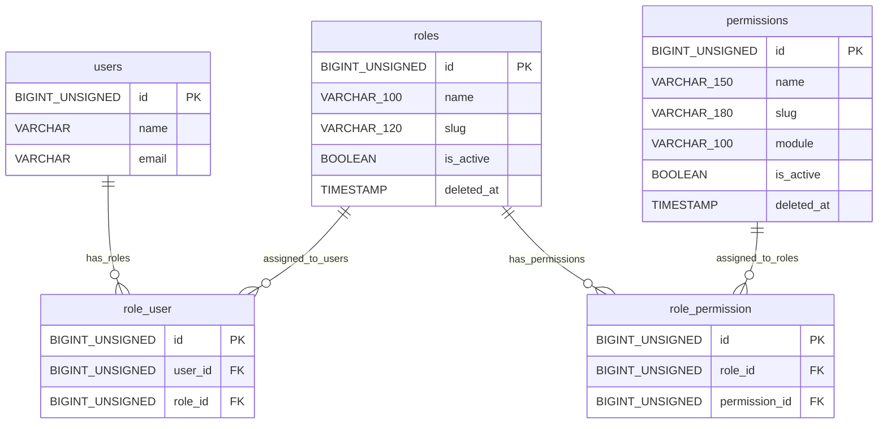
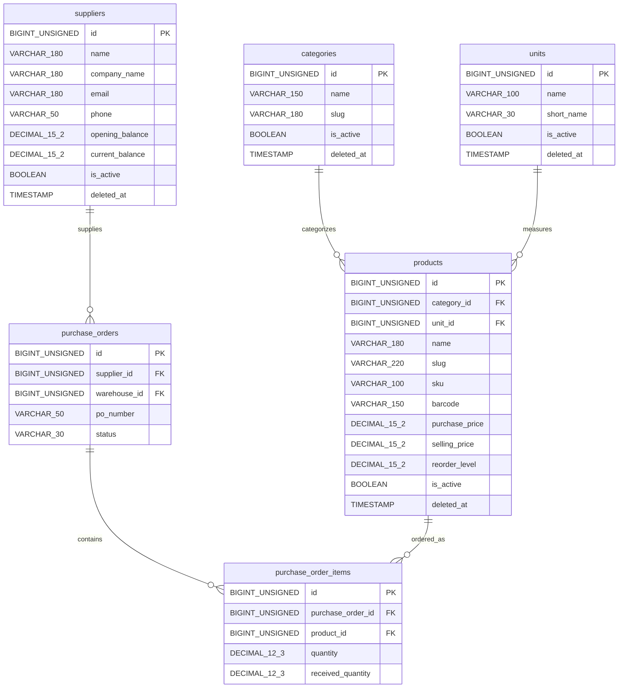
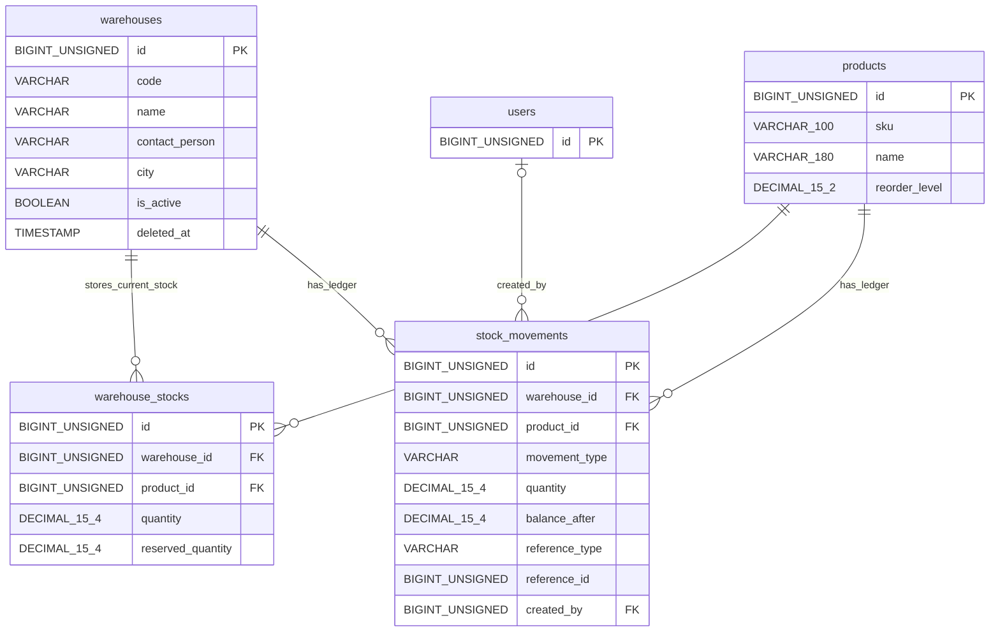
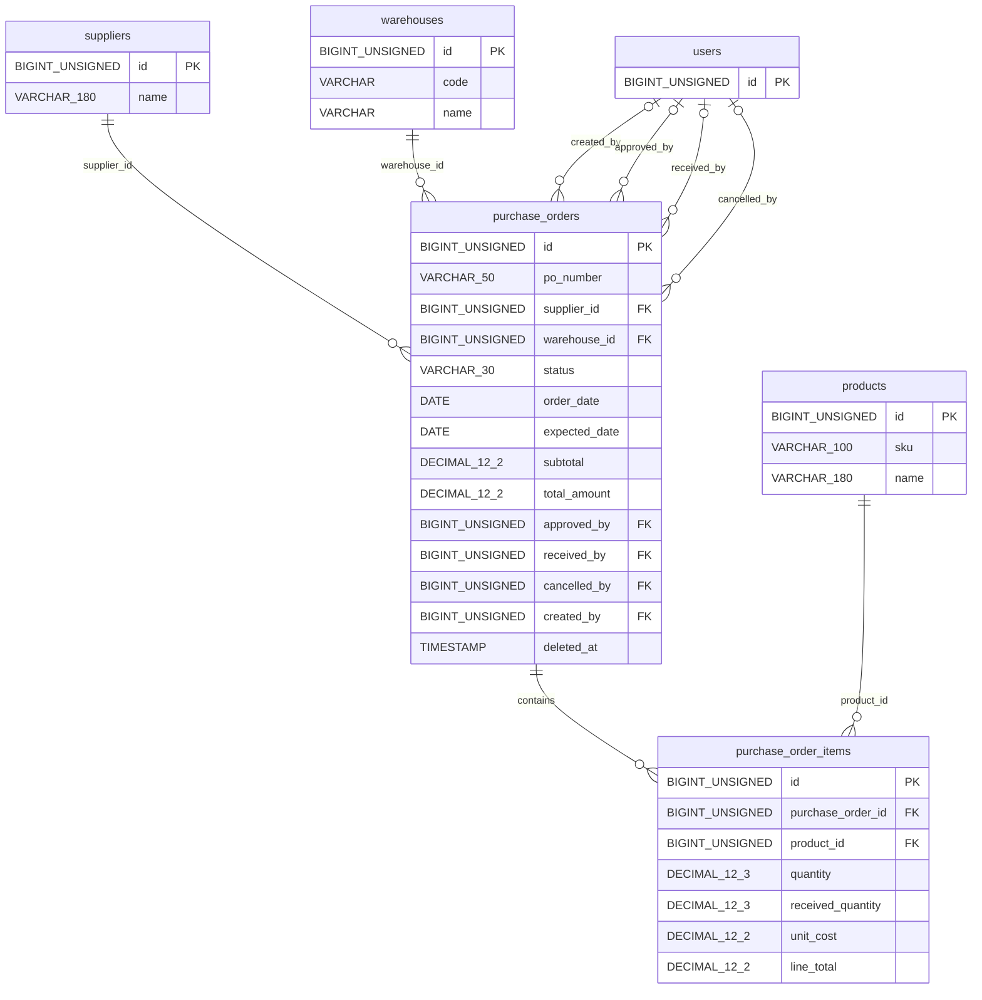
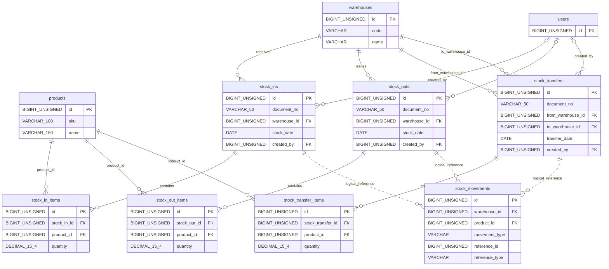
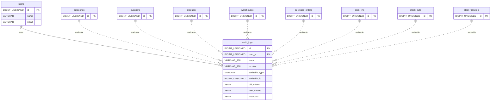

# Warehouse Management - Laravel ERD

## Purpose

This document provides portfolio-ready Entity Relationship Diagram (ERD) documentation for **Warehouse Management - Laravel**.

The ERD reflects the currently implemented Laravel migrations and is aligned with [`docs/database/database-design.md`](database-design.md). It intentionally documents the implemented schema rather than an earlier conceptual design.

## ERD Notation Legend

| Concept | Mermaid notation | Meaning |
| --- | --- | --- |
| One-to-many | `||--o{` | One parent row can relate to zero or many child rows. |
| Many-to-many | `}o--o{` | Many rows on both sides are connected through a pivot table. |
| Optional relationship | `|o` | The child foreign key is nullable. |
| Required relationship | `||` | The child foreign key is required. |
| Primary key | `PK` | Primary key column, usually `id`. |
| Foreign key | `FK` | Column that references another table primary key. |
| Logical reference | `..` | Type/id reference stored without a physical foreign key. |

## Table Grouping

| Group | Tables |
| --- | --- |
| Authentication & Authorization | `users`, `roles`, `permissions`, `role_user`, `role_permission` |
| Product Catalog | `categories`, `units`, `products` |
| Supplier Management | `suppliers` |
| Warehouse Management | `warehouses` |
| Inventory / Stock Ledger | `warehouse_stocks`, `stock_movements` |
| Purchase Order Workflow | `purchase_orders`, `purchase_order_items` |
| Stock In | `stock_ins`, `stock_in_items` |
| Stock Out | `stock_outs`, `stock_out_items` |
| Stock Transfer | `stock_transfers`, `stock_transfer_items` |
| Audit Logs | `audit_logs` |

## High-Level ERD Overview

The system separates master data from transactional inventory workflows. Product metadata lives in `products`, `categories`, and `units`; suppliers and warehouses are managed as independent master data. Current inventory is stored per warehouse/product pair in `warehouse_stocks`, while inventory history is recorded in `stock_movements`.

Purchase orders track supplier orders, approval, cancellation, and receiving status. Receiving a purchase order increases stock through service-layer logic and records `purchase_in` entries in the movement ledger.

Stock In, Stock Out, and Stock Transfer documents represent manual warehouse operations. Each document has item rows, updates current stock through services, and creates ledger entries. Transfers create both outbound and inbound movement records.

Authorization is handled through custom roles and permissions using `role_user` and `role_permission`. Audit logs preserve user and business activity through searchable `event` and `module` fields plus optional polymorphic references.

Low stock is calculated from product reorder levels and current warehouse stock; it is not stored as a persisted alert table in the current implementation.

## Implementation Notes

- Laravel framework support tables are not shown in the ERD except for `users`, because `users` is part of authentication and is referenced by business records.
- `stock_movements.reference_type` and `stock_movements.reference_id` are logical source references.
- `audit_logs.auditable_type` and `audit_logs.auditable_id` are polymorphic logical references.
- Current stock is tracked at warehouse/product level through `warehouse_stocks`.
- Stock quantities are not stored directly on `products`.

## Mermaid ER Diagrams

### Authentication & Authorization ERD

### Product / Category / Supplier ERD

Suppliers are not linked directly to products. Supplier/product traceability is captured through purchase orders and purchase order items.

### Warehouse & Inventory ERD

### Purchase Order Workflow ERD

### Stock Document Workflow ERD

The dotted links to `stock_movements` are logical references through `reference_type` and `reference_id`, not physical foreign keys.

### Audit Logs ERD

The dotted auditable links are polymorphic logical references through `auditable_type` and `auditable_id`.

### Full System ERD

```mermaid
erDiagram
    users {
        BIGINT_UNSIGNED id PK
        VARCHAR email
    }

    roles {
        BIGINT_UNSIGNED id PK
        VARCHAR_120 slug
    }

    permissions {
        BIGINT_UNSIGNED id PK
        VARCHAR_180 slug
        VARCHAR_100 module
    }

    role_user {
        BIGINT_UNSIGNED id PK
        BIGINT_UNSIGNED user_id FK
        BIGINT_UNSIGNED role_id FK
    }

    role_permission {
        BIGINT_UNSIGNED id PK
        BIGINT_UNSIGNED role_id FK
        BIGINT_UNSIGNED permission_id FK
    }

    categories {
        BIGINT_UNSIGNED id PK
        VARCHAR_180 slug
    }

    units {
        BIGINT_UNSIGNED id PK
        VARCHAR_30 short_name
    }

    suppliers {
        BIGINT_UNSIGNED id PK
        VARCHAR_180 name
    }

    products {
        BIGINT_UNSIGNED id PK
        BIGINT_UNSIGNED category_id FK
        BIGINT_UNSIGNED unit_id FK
        VARCHAR_100 sku
    }

    warehouses {
        BIGINT_UNSIGNED id PK
        VARCHAR code
    }

    warehouse_stocks {
        BIGINT_UNSIGNED id PK
        BIGINT_UNSIGNED warehouse_id FK
        BIGINT_UNSIGNED product_id FK
        DECIMAL_15_4 quantity
        DECIMAL_15_4 reserved_quantity
    }

    stock_movements {
        BIGINT_UNSIGNED id PK
        BIGINT_UNSIGNED warehouse_id FK
        BIGINT_UNSIGNED product_id FK
        VARCHAR movement_type
        BIGINT_UNSIGNED created_by FK
    }

    purchase_orders {
        BIGINT_UNSIGNED id PK
        BIGINT_UNSIGNED supplier_id FK
        BIGINT_UNSIGNED warehouse_id FK
        VARCHAR_50 po_number
        VARCHAR_30 status
    }

    purchase_order_items {
        BIGINT_UNSIGNED id PK
        BIGINT_UNSIGNED purchase_order_id FK
        BIGINT_UNSIGNED product_id FK
    }

    stock_ins {
        BIGINT_UNSIGNED id PK
        BIGINT_UNSIGNED warehouse_id FK
        BIGINT_UNSIGNED created_by FK
        VARCHAR_50 document_no
    }

    stock_in_items {
        BIGINT_UNSIGNED id PK
        BIGINT_UNSIGNED stock_in_id FK
        BIGINT_UNSIGNED product_id FK
    }

    stock_outs {
        BIGINT_UNSIGNED id PK
        BIGINT_UNSIGNED warehouse_id FK
        BIGINT_UNSIGNED created_by FK
        VARCHAR_50 document_no
    }

    stock_out_items {
        BIGINT_UNSIGNED id PK
        BIGINT_UNSIGNED stock_out_id FK
        BIGINT_UNSIGNED product_id FK
    }

    stock_transfers {
        BIGINT_UNSIGNED id PK
        BIGINT_UNSIGNED from_warehouse_id FK
        BIGINT_UNSIGNED to_warehouse_id FK
        BIGINT_UNSIGNED created_by FK
        VARCHAR_50 document_no
    }

    stock_transfer_items {
        BIGINT_UNSIGNED id PK
        BIGINT_UNSIGNED stock_transfer_id FK
        BIGINT_UNSIGNED product_id FK
    }

    audit_logs {
        BIGINT_UNSIGNED id PK
        BIGINT_UNSIGNED user_id FK
        VARCHAR_100 event
        VARCHAR_100 module
    }

    users ||--o{ role_user : user_id
    roles ||--o{ role_user : role_id
    roles ||--o{ role_permission : role_id
    permissions ||--o{ role_permission : permission_id

    categories ||--o{ products : category_id
    units ||--o{ products : unit_id
    suppliers ||--o{ purchase_orders : supplier_id
    warehouses ||--o{ purchase_orders : warehouse_id
    purchase_orders ||--o{ purchase_order_items : purchase_order_id
    products ||--o{ purchase_order_items : product_id

    warehouses ||--o{ warehouse_stocks : warehouse_id
    products ||--o{ warehouse_stocks : product_id
    warehouses ||--o{ stock_movements : warehouse_id
    products ||--o{ stock_movements : product_id
    users |o--o{ stock_movements : created_by

    warehouses ||--o{ stock_ins : warehouse_id
    users |o--o{ stock_ins : created_by
    stock_ins ||--o{ stock_in_items : stock_in_id
    products ||--o{ stock_in_items : product_id

    warehouses ||--o{ stock_outs : warehouse_id
    users |o--o{ stock_outs : created_by
    stock_outs ||--o{ stock_out_items : stock_out_id
    products ||--o{ stock_out_items : product_id

    warehouses ||--o{ stock_transfers : from_warehouse_id
    warehouses ||--o{ stock_transfers : to_warehouse_id
    users |o--o{ stock_transfers : created_by
    stock_transfers ||--o{ stock_transfer_items : stock_transfer_id
    products ||--o{ stock_transfer_items : product_id

    users |o--o{ purchase_orders : created_by
    users |o--o{ purchase_orders : approved_by
    users |o--o{ purchase_orders : received_by
    users |o--o{ purchase_orders : cancelled_by
    users |o--o{ audit_logs : user_id
```

## Relationship Documentation

| Parent table | Child table | Foreign key | Cardinality | Business meaning |
| --- | --- | --- | --- | --- |
| `users` | `role_user` | `user_id` | One-to-many pivot rows | Assigns roles to users. |
| `roles` | `role_user` | `role_id` | One-to-many pivot rows | Allows a role to be assigned to many users. |
| `roles` | `role_permission` | `role_id` | One-to-many pivot rows | Assigns permissions to roles. |
| `permissions` | `role_permission` | `permission_id` | One-to-many pivot rows | Allows a permission to belong to many roles. |
| `categories` | `products` | `category_id` | One-to-many, required | Groups products by category. |
| `units` | `products` | `unit_id` | One-to-many, required | Defines product measurement units. |
| `suppliers` | `purchase_orders` | `supplier_id` | One-to-many, required | Identifies the supplier for a purchase order. |
| `warehouses` | `purchase_orders` | `warehouse_id` | One-to-many, required | Identifies the receiving warehouse. |
| `purchase_orders` | `purchase_order_items` | `purchase_order_id` | One-to-many, required | Stores product lines under a purchase order. |
| `products` | `purchase_order_items` | `product_id` | One-to-many, required | Identifies ordered products. |
| `warehouses` | `warehouse_stocks` | `warehouse_id` | One-to-many, required | Stores current balances per warehouse. |
| `products` | `warehouse_stocks` | `product_id` | One-to-many, required | Stores current balances per product. |
| `warehouses` | `stock_movements` | `warehouse_id` | One-to-many, required | Scopes each ledger entry to a warehouse. |
| `products` | `stock_movements` | `product_id` | One-to-many, required | Scopes each ledger entry to a product. |
| `users` | `stock_movements` | `created_by` | One-to-many, optional | Records the user responsible for a movement. |
| `warehouses` | `stock_ins` | `warehouse_id` | One-to-many, required | Identifies where stock is received. |
| `stock_ins` | `stock_in_items` | `stock_in_id` | One-to-many, required | Stores received stock-in lines. |
| `warehouses` | `stock_outs` | `warehouse_id` | One-to-many, required | Identifies where stock is issued from. |
| `stock_outs` | `stock_out_items` | `stock_out_id` | One-to-many, required | Stores issued stock-out lines. |
| `warehouses` | `stock_transfers` | `from_warehouse_id` | One-to-many, required | Identifies the transfer source warehouse. |
| `warehouses` | `stock_transfers` | `to_warehouse_id` | One-to-many, required | Identifies the transfer destination warehouse. |
| `stock_transfers` | `stock_transfer_items` | `stock_transfer_id` | One-to-many, required | Stores transferred product lines. |
| `products` | `stock_in_items` | `product_id` | One-to-many, required | Identifies received products. |
| `products` | `stock_out_items` | `product_id` | One-to-many, required | Identifies issued products. |
| `products` | `stock_transfer_items` | `product_id` | One-to-many, required | Identifies transferred products. |
| `users` | `purchase_orders` | `created_by` | One-to-many, optional | Records the purchase order creator. |
| `users` | `purchase_orders` | `approved_by` | One-to-many, optional | Records the purchase order approver. |
| `users` | `purchase_orders` | `received_by` | One-to-many, optional | Records who completed receiving. |
| `users` | `purchase_orders` | `cancelled_by` | One-to-many, optional | Records who cancelled the order. |
| `users` | `stock_ins` | `created_by` | One-to-many, optional | Records the stock-in creator. |
| `users` | `stock_outs` | `created_by` | One-to-many, optional | Records the stock-out creator. |
| `users` | `stock_transfers` | `created_by` | One-to-many, optional | Records the stock transfer creator. |
| `users` | `audit_logs` | `user_id` | One-to-many, optional | Records the user who performed an audited action. |

## Logical References

| Source | Target | Reference columns | Business meaning |
| --- | --- | --- | --- |
| `stock_ins` | `stock_movements` | `reference_type`, `reference_id` | Stock In documents create `stock_in` ledger entries. |
| `stock_outs` | `stock_movements` | `reference_type`, `reference_id` | Stock Out documents create `stock_out` ledger entries. |
| `stock_transfers` | `stock_movements` | `reference_type`, `reference_id` | Transfers create `transfer_out` and `transfer_in` ledger entries. |
| `purchase_orders` | `stock_movements` | `reference_type`, `reference_id` | Purchase order receiving creates `purchase_in` ledger entries. |
| Business records | `audit_logs` | `auditable_type`, `auditable_id` | Audit logs can point to many auditable record types. |

## Foreign Key Summary

| Table | Foreign Key | References | On Delete behavior | Relationship type |
| --- | --- | --- | --- | --- |
| `role_user` | `user_id` | `users.id` | `cascadeOnDelete()` | Pivot |
| `role_user` | `role_id` | `roles.id` | `cascadeOnDelete()` | Pivot |
| `role_permission` | `role_id` | `roles.id` | `cascadeOnDelete()` | Pivot |
| `role_permission` | `permission_id` | `permissions.id` | `cascadeOnDelete()` | Pivot |
| `products` | `category_id` | `categories.id` | `restrictOnDelete()` | Required one-to-many |
| `products` | `unit_id` | `units.id` | `restrictOnDelete()` | Required one-to-many |
| `warehouse_stocks` | `warehouse_id` | `warehouses.id` | `restrictOnDelete()` | Required one-to-many |
| `warehouse_stocks` | `product_id` | `products.id` | `restrictOnDelete()` | Required one-to-many |
| `stock_movements` | `warehouse_id` | `warehouses.id` | `restrictOnDelete()` | Required one-to-many |
| `stock_movements` | `product_id` | `products.id` | `restrictOnDelete()` | Required one-to-many |
| `stock_movements` | `created_by` | `users.id` | `nullOnDelete()` | Optional one-to-many |
| `purchase_orders` | `supplier_id` | `suppliers.id` | `restrictOnDelete()` | Required one-to-many |
| `purchase_orders` | `warehouse_id` | `warehouses.id` | `restrictOnDelete()` | Required one-to-many |
| `purchase_orders` | `approved_by` | `users.id` | `nullOnDelete()` | Optional one-to-many |
| `purchase_orders` | `received_by` | `users.id` | `nullOnDelete()` | Optional one-to-many |
| `purchase_orders` | `cancelled_by` | `users.id` | `nullOnDelete()` | Optional one-to-many |
| `purchase_orders` | `created_by` | `users.id` | `nullOnDelete()` | Optional one-to-many |
| `purchase_order_items` | `purchase_order_id` | `purchase_orders.id` | `cascadeOnDelete()` | Required detail rows |
| `purchase_order_items` | `product_id` | `products.id` | `restrictOnDelete()` | Required one-to-many |
| `stock_ins` | `warehouse_id` | `warehouses.id` | `restrictOnDelete()` | Required one-to-many |
| `stock_ins` | `created_by` | `users.id` | `nullOnDelete()` | Optional one-to-many |
| `stock_in_items` | `stock_in_id` | `stock_ins.id` | `cascadeOnDelete()` | Required detail rows |
| `stock_in_items` | `product_id` | `products.id` | `restrictOnDelete()` | Required one-to-many |
| `stock_outs` | `warehouse_id` | `warehouses.id` | `restrictOnDelete()` | Required one-to-many |
| `stock_outs` | `created_by` | `users.id` | `nullOnDelete()` | Optional one-to-many |
| `stock_out_items` | `stock_out_id` | `stock_outs.id` | `cascadeOnDelete()` | Required detail rows |
| `stock_out_items` | `product_id` | `products.id` | `restrictOnDelete()` | Required one-to-many |
| `stock_transfers` | `from_warehouse_id` | `warehouses.id` | `restrictOnDelete()` | Required one-to-many |
| `stock_transfers` | `to_warehouse_id` | `warehouses.id` | `restrictOnDelete()` | Required one-to-many |
| `stock_transfers` | `created_by` | `users.id` | `nullOnDelete()` | Optional one-to-many |
| `stock_transfer_items` | `stock_transfer_id` | `stock_transfers.id` | `cascadeOnDelete()` | Required detail rows |
| `stock_transfer_items` | `product_id` | `products.id` | `restrictOnDelete()` | Required one-to-many |
| `audit_logs` | `user_id` | `users.id` | `nullOnDelete()` | Optional one-to-many |

## Portfolio Explanation

This ERD is production-ready because it separates master data, transactional documents, current stock balances, ledger history, authorization, and audit history.

- **Normalized structure:** Catalog, supplier, warehouse, purchase, stock, authorization, and audit data are separated into focused tables.
- **Clear module boundaries:** Authentication, catalog, warehouse, stock, purchase order, report, dashboard, and audit features can evolve independently.
- **Traceable stock movement:** Current stock is stored in `warehouse_stocks`, while every successful stock mutation is explained by `stock_movements`.
- **Auditability:** Important actions are recorded in `audit_logs` with actor, event, module, request context, and optional auditable references.
- **Scalable warehouse/product design:** The unique `warehouse_id` and `product_id` pair in `warehouse_stocks` supports multi-warehouse inventory without changing product master data.

## Common Implementation Notes

- Use Laravel `belongsTo` on child models that contain a foreign key, such as `Product::category()`, `PurchaseOrder::supplier()`, and `StockMovement::product()`.
- Use Laravel `hasMany` on parent models, such as `Category::products()`, `Warehouse::stocks()`, `PurchaseOrder::items()`, and `Product::stockMovements()`.
- Use Laravel `belongsToMany` for user-role and role-permission access through `role_user` and `role_permission`.
- Treat `role_user` and `role_permission` as pivot tables with composite uniqueness on their paired foreign keys.
- Use `foreignId()` with explicit `restrictOnDelete()`, `cascadeOnDelete()`, or `nullOnDelete()` according to the migration behavior.
- Index foreign keys and high-use filter fields such as status, dates, `movement_type`, `event`, and `module`.
- Keep stock mutation logic in services wrapped in database transactions.
- Update `warehouse_stocks` only through controlled stock workflows and always create the corresponding `stock_movements`.
- Store status values as strings and control transitions through model constants, Form Request validation, and service-layer workflow checks.
- Use decimal columns for money and inventory quantities to avoid floating-point precision problems.
